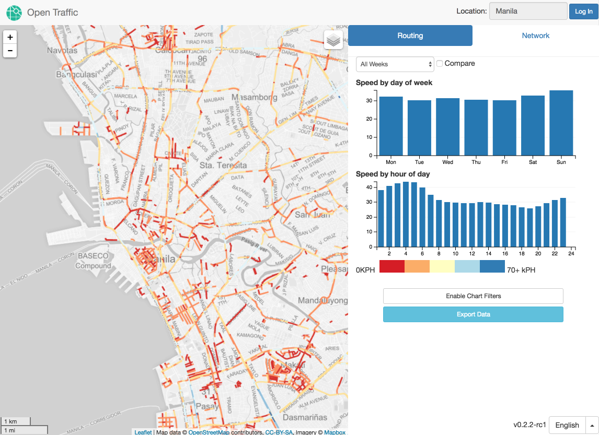
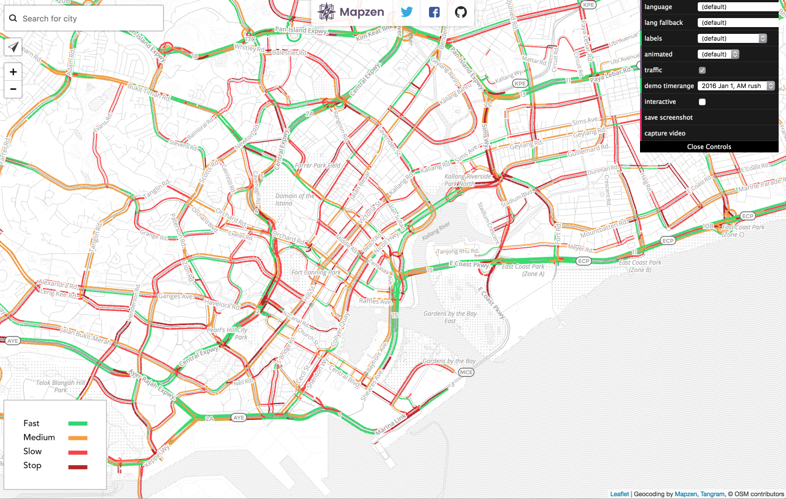

# Open Traffic v2 platform

Open Traffic is a global data platform to process anonymous positions of vehicles and smartphones into real-time and historical traffic statistics. We're building this in the open, using fully open-source software, with involvement from a growing list of partners.

After a successful proof-of-concept by the World Bank, Grab, and Conveyal (known as OTv1), Mapzen is working with the partners to build out a new version of the platform that will scale to have global coverage (known as OTv2).

## Technical architecture

<!-- https://drive.google.com/open?id=1ByaTsaVZOfktk14ev57kM7qIqH1Da3dS9UtiTrTPJpU -->

## Data flows

<!-- https://docs.google.com/a/mapzen.com/drawings/d/146rb5VQ1js5_NZ-lP_Dh3t8nkkDcb2Bmibsncp05VLA/edit?usp=sharing -->

## System Components

### OSMLR segment generation

The [OSMLR application](https://github.com/opentraffic/osmlr) creates traffic segments according to the [OSMLR tile spec](https://github.com/opentraffic/osmlr-tile-spec). Outputs are in protocol buffer and GeoJSON formats. This process will be run on a regular basis, on centralized servers, with the resulting worldwide OSMLR tile set available for free use by all.

→ See [this blog post](https://mapzen.com/blog/open-traffic-osmlr-technical-preview) for an introduction to OSMLR. 

### Reporter

Reporter takes in raw GPS probe data, matches it to OSMLR segments using [Valhalla Meili](https://github.com/valhalla/valhalla/blob/master/docs/meili.md), and sends segments and speeds to the centralized Open Traffic Datastore.

Reporter is available as a set of Docker containers, or can be run anywhere Python and Redis are available.

Reporter expects its input of GPS points as HTTP requests. It also includes a script to parse CSV files and generate the appropriate HTTP requests. The code can be customized to act on a stream (such as Apache Kafka or AWS Kinesis).

(In OTv1, this component was called the [Traffic Engine](https://github.com/opentraffic/traffic-engine).)

→ See more documentation in [the Reporter repository](https://github.com/opentraffic/reporter).

### Datastore

The [Datastore](https://github.com/opentraffic/datastore) ingests input from distributed [Reporter](https://github.com/opentraffic/reporter) instances. Its contents can be queried using the [Open Traffic API](https://github.com/opentraffic/api). The Datastore is also used to created processed data products.

API outputs and processed data products include a range of statistics computed on anonymized and aggregated traffic speeds. Statistics are associated with OSMLR segments.

(In OTv1, this component was called the Data Pool. Its API was called the [Traffic Engine App](https://github.com/opentraffic/traffic-engine-app).)

### Analysis web interfaces

For users unable to directly query an API or parse a static data extract, OTv2 will provide a simple web app for performing basic queries.

(In OTv1, this component was the [Traffic Engine App](https://github.com/opentraffic/traffic-engine-app).) Here is a screenshot of the OTv1 interface in action:

Slightly more advanced users are provided with sample queries in Jupyter Notebooks, which they can expand using Python tooling (such as SciPy, Pandas, and Matplotlib).

### Traffic-influenced routing engine

The [Valhalla routing engine](https://github.com/valhalla) will offer journey-planning that is weighted by historical and real-time speeds.

→ See [this blog post](https://mapzen.com/blog/speed-tiles/) for a proof-of-concept using traffic speeds to influence Valhalla routing.

### Traffic maps

The Datastore will also generate static data extracts that can be used to power user-facing traffic maps.

→ See [this demo](https://mapzen.github.io/open-traffic-poc-data-demo/) using the Tangram map rendering library to display an entire day's worth of traffic in Manila (from the OTv1 platform). Here is an animated screenshot of some of the map:

→ See [this code](https://github.com/opentraffic/tangram-viz-experiments) using the Tangram map rendering library to display speeds from the OTv2 API. Here is a screenshot of this map showing traffic in Singapore:

